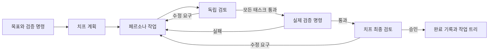

# Agent Valley 운용 점검 — 2026-10-03

## 결론

GUI 부재가 핵심 원인은 아니었다. 대시보드는 이미 있었지만 실패·대기·복구 상태가 부족했다. 더 큰 문제는 설치 안내와 실제 실행 경로의 불일치, 프로세스 및 스케줄러 버그, 그리고 목표 전체를 책임지는 치프 계층의 부재였다. `breakdown`은 이슈를 나누지만 결과를 다시 받아 목표 달성 여부를 판단하는 감독자는 아니었다.

이번 점검은 스킬이나 OMA 워크플로를 실행하지 않고 코드, 테스트, CLI 계약, 공식 문서로 진행했다. 저장소에 이미 있던 OMA 15.0.10 업데이트는 보존했다. 제품의 새 `--oma` 경로는 사용자가 실행할 때 선택한 스킬과 완료 증거를 사용한다.

## 사용자별 전 과정

| 사용자 | 진입 → 작업 → 운용 | 확인한 막힘 | 변경과 검증 |
|---|---|---|---|
| 처음 설치하는 개인 개발자 | 소스 체크아웃 → setup → doctor → dev/up | 같은 디렉터리로 설치 파일 복사, 파이프 입력을 읽는 질문, 필수 검증 설정 누락, 존재하지 않는 supervisor.js | 멱등 설치, `--yes`, TTY 입력, 완료 계약 설정, 소스 실행 경로, 실제 임시 프로세스로 준비 상태·종료 검사 |
| 기존 제품 저장소 관리자 | 지침 설치 → 대상 Git 저장소 연결 → 첫 작업 | 지침 설치와 런타임 설치 혼동, 오래된 WORKFLOW/env 안내 | 설치 목적과 실행 경로 구분, YAML 기준 가이드, 대상 저장소와 검증 명령 안내 |
| Linear 기반 팀 | 라벨·의존성 생성 → Todo → 병렬 실행 → Done | 관계 생성 전 실행 시작, 반대 방향 의존성 누락, 막힌 작업이 슬롯 점유 | draft 생성 후 관계 설정·공개, inverseRelations 조회, 슬롯 예약과 의존성 재평가 |
| GitHub 기반 팀 | setup → issue → webhook → 작업 | CLI issue 경로가 Linear에 고정, 서명·라우트 안내 불일치 | GitHub 이슈 생성, 정확한 webhook 경로, 지원하지 않는 계층 분해는 명시적 오류 |
| 목표를 맡기는 사용자 | 치프에게 주문 → 역할 배정 → 검토 → 수정 → 완료 | 결과를 다시 평가하는 치프와 지속 상태 없음 | `av order`, 이름·역할·모델·스킬별 페르소나, 독립 검토, 필수 검증, 제한된 수정, `av missions`, 재개 |
| 리서치 사용자 | 조사 지시 → 보고서 → 출처·산출물 검토 | stdout 설명만으로 결과가 흩어짐 | 파일 산출물 요구, 보고서 검사 명령, 연구 역할·선택적 oma-search |
| 상시 운용 담당자 | 상태 확인 → 개입 → 장애 → 재시작 | 정상처럼 보이는 초기화 실패, 누락된 재시도, 종료 후 남은 프로세스 | health 503, SSE 재연결, 대기·재시도·실패 작업 패널, 세션 정리, 복구 PID 추적 |

## 수정한 실행 결함

- Codex app-server에 현재 계약에 없는 `turn/append`를 보내고 있었다. 설치된 Codex 0.160.0의 생성 스키마와 대조하여 초기화, `turn/steer`, turn ID, 중단, 실패 상태, 사용량·파일 변경 이벤트를 정리했다.
- NDJSON 마지막 줄에 개행이 없으면 완료 이벤트를 잃었다. 공통 디코더로 처리하고, 결과 없이 종료한 프로세스는 즉시 오류로 보고한다. stderr 파이프를 비워 대량 출력에서 멈추는 문제도 막았다.
- OpenCode의 오류 이벤트를 정상 종료 코드 때문에 성공으로 오인할 수 있었다. 명시적 오류를 완료보다 우선한다.
- 정상 완료·예외·취소·늦게 끝난 spawn 뒤에도 세션이 남을 수 있었다. 세션 종료를 추적하고 기다린 후 다음 단계로 넘어간다. 취소된 실행은 납품하지 않는다.
- 작업 준비 중에는 병렬 슬롯이 예약되지 않았다. 준비 작업까지 점유로 계산하고, 의존성 때문에 대기하는 이슈는 슬롯을 차지하지 않는다.
- 대기·재시도·재시작 경로가 오류 정보나 시도 횟수를 잃거나 작업을 중복 실행할 수 있었다. 실패 문맥을 보존하고, 복구한 실행 PID가 살아 있는 동안 새 작업을 겹쳐 실행하지 않는다.
- Linear webhook만으로는 의존성 그래프가 충분하지 않았다. 실제 이슈를 다시 조회하고 incoming `blocks` 관계를 `blocked_by`로 정규화했다. 공식 스키마의 관계 방향을 기준으로 했다. [Linear SDK schema](https://github.com/linear/linear/blob/master/packages/sdk/src/schema.graphql)
- 검증 명령의 타임아웃이 셸의 자식 프로세스를 남길 수 있었다. 프로세스 그룹 종료, 중단 신호, 수집 중 출력 제한을 추가했다.
- 치프가 강제 종료된 뒤 남은 작업자와 새 작업자가 같은 파일을 수정할 수 있었다. 실행 전 마커와 PID·프로세스 그룹을 저장하고, 남은 프로세스가 있으면 재개를 차단한다. 종료·취소·검증 성공 뒤에도 손자 프로세스가 파일을 쓰지 못하는 실제 프로세스 회귀를 추가했다.
- OMA 어댑터의 버전 고정과 `--root` 옵션이 설치된 15.0.10과 달랐다. `--project-root`로 맞추고 실제 CLI의 코드·분석 receipt 생성과 변조 거부를 검사했다.
- OMA 중간 태스크에 전체 목표의 최종 검사를 요구하면 선행 태스크가 끝날 수 없다. 중간 receipt는 시작 커밋을 고정한 `git diff --check <task-start-HEAD> --`와 작업별 증거를 검토하며, 전체 검증 명령은 모든 태스크 뒤에 실행한다. 중간 패치 검사는 기능 검증을 대신하지 않는다.

## Grok Bot, OpenAI dot, Hermes와의 비교

Grok Bot은 이름과 역할을 가진 봇, 유지되는 문맥, 공유 클라우드 컴퓨터, 봇 사이의 협업을 제공한다. 사용자에게 중요한 차이는 작업을 맡긴 대상이 다음 단계와 인계를 계속 책임진다는 점이다. 공개 Grok Build 저장소는 CLI 런타임이며 Grok Bot 클라우드 서비스 구현 전체로 취급할 수 없다. [Grok Bot 공식 개요](https://docs.x.ai/grok-bot/overview), [Grok Build 소스](https://github.com/xai-org/grok-build)

OpenAI dot 역시 목표를 받아 대화 사이에도 진행하는 에이전트다. 공식 안내에는 이름 설정, 클라우드 컴퓨터, 선택적 로컬 접근, Work/Codex 작업 생성과 예약 작업이 설명돼 있다. dot 자체 서비스의 공개 구현은 이번 조사에서 확인하지 못했다. Codex 공개 소스와 dot 서비스는 구분해야 한다. [dot 공식 안내](https://help.openai.com/en/articles/20001530-getting-started-with-your-dot), [Codex 소스](https://github.com/openai/codex)

Hermes는 공개 소스로 위임 경로까지 확인할 수 있었다. 자식 실행 결과를 부모에게 돌려주고, 부모가 계속 판단할 수 있는 경로를 둔다. 일회성 호출처럼 후속 결과를 받을 소비자가 없으면 동기 실행으로 돌리는 처리도 있다. [위임 설명](https://hermes-agent.nousresearch.com/docs/user-guide/features/delegation/), [실제 dispatch 구현](https://github.com/NousResearch/hermes-agent/blob/main/tools/delegate_tool_dispatch.py)

Hermes 자식 실행부에는 중단 전파, 종료 정리, 출력 스키마 검증과 한 번의 교정 호출이 있다. 스키마 검증 실패 후에도 원문을 보존하므로, 그 완료 상태만으로 제품의 수용 조건을 통과했다고 볼 수는 없다. Agent Valley는 별도의 실제 검증 명령과 최종 검토를 모두 요구한다. [Hermes child 실행 구현](https://github.com/NousResearch/hermes-agent/blob/main/tools/delegate_tool_child_run.py)

위 제품들의 내부 구현이 동일하다는 뜻은 아니다. 확인한 문서와 소스에서 Agent Valley에 적용한 공통 구조는 **목표 소유자 → 구체적 위임 → 결과 회수 → 검증 → 수정 또는 완료**다.

## 새 치프 경로

각 단계의 상태와 검토 결과를 로컬에 저장한다. 재개할 때 파일 지문이 달라지면 기존 승인을 무효화한다. 계획과 검토 단계의 제품 파일 변경, 순환 의존성, 없는 페르소나, 산출물 없는 완료를 거절한다. 모델은 검증 명령을 선택하거나 교체하지 않는다. 명령은 운영자의 CLI 입력 또는 YAML 설정에서만 온다.

한 주문 안에서는 같은 작업 트리의 파일을 공유하므로 전문 작업자를 순차 실행한다. 기존 이슈 스케줄러의 병렬 실행은 별도 경로다. 주문 결과는 작업 트리와 브랜치에 남으며 자동 푸시·머지는 하지 않는다. 사용법은 [chief missions](../guides/chief-missions.md)에 있다.

## 검증 범위와 남은 차이

최종 로컬 검사: 135개 테스트 파일의 1,625개 테스트 통과. 커버리지는 statements 90.22%, branches 81.20%, functions 91.59%, lines 93.27%다. `./scripts/harness/validate.sh`의 5개 검사, `bun run typecheck`, `bun run lint`가 통과했다. 수정 문서의 로컬 링크 18개도 확인했다. 린트의 기존 경고는 남아 있으며 오류는 없다.

회귀 테스트에는 임시 Git 저장소, 실제 자식 프로세스, 가짜 에이전트 프로토콜, 실제 검증 셸, 잘못된 종료·누락된 개행·중단·재개가 포함된다. OMA receipt 검사는 설치된 CLI를 사용하며, 모델 호출과 스킬 실행은 하지 않는다. 새 치프는 `runOrder`부터 worktree 생성·계획·작업·독립 검토·실제 검사·최종 승인·재개까지 같은 경로로 실행한다.

실제 유료 모델과 연결된 Linear/GitHub 계정에서 작업을 생성하지는 않았다. 브라우저 수동 조작, 모든 공급자의 인증된 실작업, 운영 환경의 장시간 부하도 이번 검증에 포함되지 않는다. 대시보드는 컴포넌트·라우트·SSE·초기화 테스트로 확인했다. 빌드와 패키징은 실행하지 않았다.

남은 제품 차이는 상시 메시징 봇, 미션 간 장기 기억, 클라우드 컴퓨터 제공, 여러 머신의 통합 스케줄링, 치프 주문용 웹 UI, 한 주문 내부의 병렬 브랜치 통합이다. 이들은 새 로컬 치프가 제공한다고 주장하지 않는다. npm CLI만으로 대시보드까지 배포되는 패키지도 아직 아니므로, 현재 가이드는 소스 체크아웃 실행 경로를 제시한다.

테스트가 많다는 것과 운용 경계가 검증됐다는 것은 달랐다. 기존 테스트의 가짜 프로토콜이 실제 공급자 계약과 어긋난 사례, 실제 프로세스와 Git 테스트의 과도한 병렬 실행을 확인했다. 기본 Vitest worker 수를 4로 제한하고 실제 경계를 통과하는 회귀 사례를 추가했다. 애플리케이션 린트가 OMA 관리 파일의 포맷을 다시 쓰지 않도록 범위도 정리했다.
